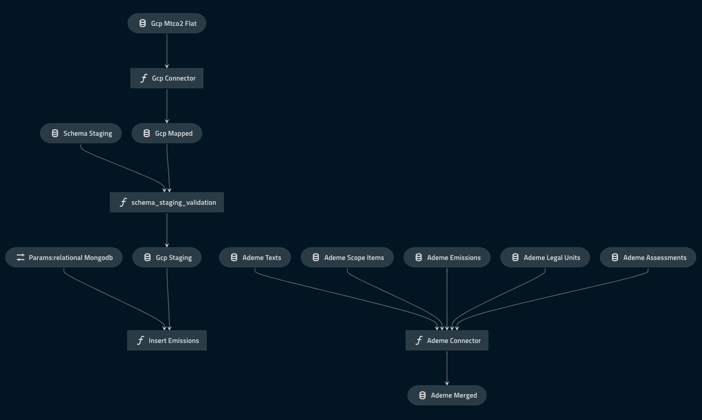

[[_TOC_]]

# OGS Connectors

## Overview

This repository regroups the connectors used for the OGS project.
What we call a "connector" is a packaged piece of code whose role is to integrate data from an outside source to our database(s), in a reliable way.
In our case, the goal is to Extract and Transform data from the different open data sources to finally Load them into our environment (often called ETL).

We distinguish two major external data sources (not exhaustive list):
- **APIs**: "pullable" data from servers, often also allowing live data access
- **Files**: downloadable data from websites, most of the time "snapshots"

In the first weeks of OGS, we will focus on _files_, being the simplest way to access data.

The raw data extracted from websites will be stored in our cloud provider's datalake, currently [AWS S3](https://aws.amazon.com/s3/).
S3 is an easy access datalake, allowing us to share a single shared storage environment, with great read and write performances.

## Kedro

### What is it ?

At OGS, we are using Kedro as our main python developing framework.
Simply put, Kedro is a python library which offers a project structure/organization that facilitates the set up of reliable data pipelines, from data exploration, to production ready code.
The main features that we will be taking advantage of are:
- **Project structure**: Software-Engineering based code organisation. 
- **Data catalog**: A simple declarative file to define the input output of your code, without caring about the read/write methods anymore.
- **Pipelines / Nodes**: A DAG (direct acyclic graph) conception, allowing us to build well-defined data flows.
- **Kedro-viz**: Useful visualization of the project's DAGs at a single glance.
- **Notebook integration**: Kedro allows the creation of notebooks to prototype your workflows, _using the datacatalog_!

We believe than using such a framework will facilitate the collaboration among the community. 
Since its release in 2019, it got a lot of success from data science community, and the dev team keeps bringing additional features.
I personally highly recommend starting using it even for personal projects, especially for the code organization feature, which really helps when your project tends to get complicated.

If you want to know more about the Kedro's motivations, you can check their [original article](https://medium.com/quantumblack/introducing-kedro-the-open-source-library-for-production-ready-machine-learning-code-d1c6d26ce2cf) on medium.
All the documentation is pretty straightforward: [Kedro documentation](https://kedro.readthedocs.io).

We are using version `0.17.2`

In the following we'll dive into some major features.

We will be using the ADEME data for the following examples, explained [here](https://opengeoscales.github.io/CarbonData/#ademe).

### Data Catalog

The data catalog is one of the most useful feature in Kedro. It allows us to define a dataset in a yaml file, it can be used for both input and output purposes.
By defining a dataset within the data catalog, it can easily be read or written.
The data catalog is defined in `conf/base/catalog.yml`.

Let's take an example. We define the entry for one of the ademe file: 

```yaml
ademe_assessments:
  type: pandas.CSVDataSet
  filepath: s3://opengeoscales-dev/raw/ademe/beges/assessments.csv
  credentials: dev_s3
```

Root key: _ademe_assessments_ is the name of our dataset, used as an identifier of the dataset.
On the next level one defines a set of mandatory and optional parameters.

In our case we simply precise the **type** of our dataset: _pandas.CSVDataset_, meaning our dataset is a CSV file that we want to manipulate as a Pandas DataFrame.
**filepath** is the location of the file. In our case it is situated on AWS s3, so we include the full path.
Next key is the **credentials**, it is necessary as we are using s3 and therefore need some credentials to access it.
More can be found about credentials in the [credentials section](#credentials).

Within a kedro jupyter notebook, we can then list the defined datasets using:
```python
# catalog is an object instantiated by default when starting a kedro jupyter notebook
catalog.list()
```

We can then directly access one dataset 
```python
# Load our pandas DataFrame
assessments_df = catalog.load('ademe_assessments')
```

Super easy!

All the documentation related to data catalog can be found [here](https://kedro.readthedocs.io/en/stable/05_data/01_data_catalog.html).

### Pipelines / Nodes


## How to use

### Before starting

Kedro highly recommend that you use a virtual environment. In order to do so, follow the instructions [here](https://kedro.readthedocs.io/en/stable/02_get_started/01_prerequisites.html#virtual-environments). 
I recommend using:
- conda environment over venv
- having the name `ogs-connectors` as the name of the conda virtual environment
- using python=3.9

Make sure you activate our environment each time you are opening your terminal to work on the project.
```
conda activate ogs-connectors
```

### Get the project

Install the project using git clone
```
git clone https://github.com/OpenGeoScales/ogs-connectors.git
```

Move to the created directory
```
cd ogs-connectors
```

Install the dependencies
```
pip install -r src/requirements.txt
```

Test the kedro installation
```
kedro info
```

The command should be recognized, and you should see the kedro logo as well as the version.

### Install the project

To install the kedro's dependencies, make sure you are at the rood of the directory and run:

```
kedro install
```

You should see at the end `Requirements installed!`

### Trying out jupyter

By default, Jupyter will be installed. You can launch it through the command:
```
kedro jupyter notebook
```

You can try out to create a new notebook in the `notebooks/` directory.


### Credentials

Credentials need to be filled in a file located at `conf/local/credentials.yml`. File needs to be created manually, and **should never be pushed onto git**.

Structure is as followed:

```yaml
# conf/local/credentials.yml
# Here you can define credentials for different data sets and environment.
dev_s3:
  key: YOUR S3 KEY
  secret: YOUR S3 secret
```


## Connectors

Pipelines overview:



Generated using kedro viz

- [Ademe](src/ogs_connectors/pipelines/ademe/README.md)

## Contribute

## How to install dependencies

Declare any dependencies in `src/requirements.txt` for `pip` installation and `src/environment.yml` for `conda`
installation.

## How to run Kedro

You can run your Kedro project with:

```
kedro run
```

It will run the default pipeline, defined here _src/ogs_connectors/pipeline_registry.py_ as the \___default__\_.

## How to test your Kedro project

Have a look at the file `src/tests/test_run.py` for instructions on how to write your tests. You can run your tests as
follows:

```
kedro test
```

To configure the coverage threshold, look at the `.coveragerc` file.

## Project dependencies

To generate or update the dependency requirements for your project:

```
kedro build-reqs
```

